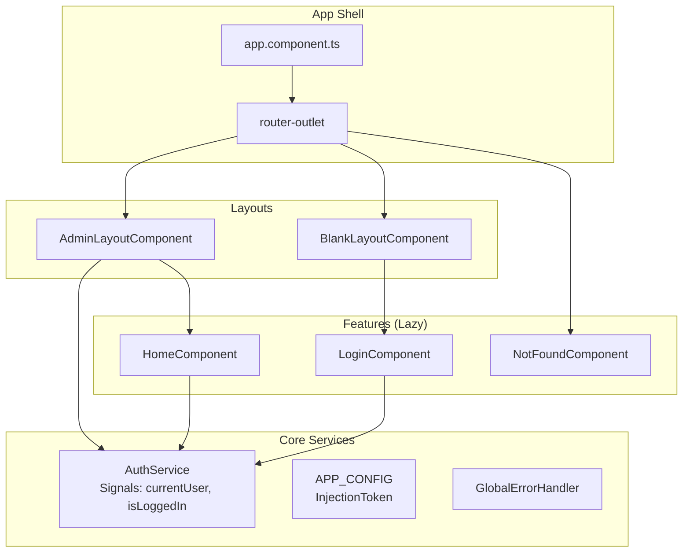

# Design Document: Fully Functional Skeleton

## Overview

This design document details the technical implementation of the Fully Functional Skeleton for an Angular v21 enterprise application. The skeleton establishes the foundational architecture including directory structure, visual system (Tailwind CSS + PrimeNG), core services (AuthService, Error Handling, Configuration), routing with lazy loading, and developer experience enhancements (path aliases).

## Steering Document Alignment

### Technical Standards (tech.md)

| Standard | Implementation |
|----------|----------------|
| **Zoneless Architecture** | No Zone.js dependencies; all state via Signals |
| **Signal-based State** | AuthService exposes `currentUser`, `isLoggedIn`, `isLoading` as Signals |
| **RxJS Internal Only** | BehaviorSubjects used internally in services; `toSignal()` for public API |
| **OnPush Change Detection** | All components use `ChangeDetectionStrategy.OnPush` |
| **Standalone Components** | All components are `standalone: true` |
| **Modern Control Flow** | `@if`, `@for`, `@switch` instead of structural directives |
| **Function-based I/O** | `input()`, `output()` instead of decorators |
| **inject() Function** | No constructor injection |

### Project Structure (structure.md)

```
src/app/
├── core/                          # Singleton Layer
│   ├── auth/
│   │   ├── auth.service.ts        # Signal-based auth state
│   │   ├── auth.guard.ts          # Route protection (placeholder)
│   │   └── auth.interceptor.ts    # HTTP auth headers (placeholder)
│   ├── layout/
│   │   ├── admin-layout/          # Post-login shell
│   │   │   └── admin-layout.component.ts
│   │   ├── blank-layout/          # Pre-login shell
│   │   │   └── blank-layout.component.ts
│   │   ├── header/
│   │   │   └── header.component.ts
│   │   ├── sidebar/
│   │   │   └── sidebar.component.ts
│   │   └── footer/
│   │       └── footer.component.ts
│   ├── config/
│   │   └── app.config.ts          # APP_CONFIG InjectionToken
│   └── services/
│       ├── error.handler.ts       # GlobalErrorHandler
│       └── error.interceptor.ts   # HTTP error interceptor
├── shared/                        # Reusable Layer (zero business logic)
│   ├── ui/
│   │   └── .gitkeep
│   ├── pipes/
│   │   └── .gitkeep
│   ├── directives/
│   │   └── .gitkeep
│   └── utils/
│       └── .gitkeep
└── features/                      # Business Layer (lazy-loaded)
    ├── home/
    │   ├── home.routes.ts
    │   └── home.component.ts
    ├── auth/
    │   ├── auth.routes.ts
    │   └── login/
    │       └── login.component.ts
    └── not-found/
        └── not-found.component.ts
```

## Code Reuse Analysis

### Existing Components to Leverage

- **PrimeNG Components**: Button, Menu, Sidebar, Toolbar for layout UI
- **Tailwind CSS**: Utility classes for spacing, typography, responsive design
- **Angular Router**: Built-in lazy loading, guards, route data

### Integration Points

- **HttpClient**: Configured with interceptors via `provideHttpClient(withInterceptors([...]))`
- **PrimeNG Theme**: Aura theme from `@primeuix/themes` integrated in `app.config.ts`

---

## Architecture

### High-Level Architecture



### Modular Design Principles

- **Single File Responsibility**: Each component/service handles one concern
- **Component Isolation**: Layout components are separate from feature components
- **Service Layer Separation**: AuthService manages auth state; Interceptors handle HTTP concerns
- **Utility Modularity**: Shared utilities in `@shared/utils/` for cross-cutting concerns

---

## Components and Interfaces

### 1. AuthService

- **Location**: `@core/auth/auth.service.ts`
- **Purpose**: Manage authentication state using Signals
- **Public API**:
  ```typescript
  readonly currentUser: Signal<User | null>
  readonly isLoggedIn: Signal<boolean>
  readonly isLoading: Signal<boolean>
  login(credentials: LoginCredentials): void
  logout(): void
  ```
- **Internal Implementation**: `WritableSignal` for state, `computed()` for derived state
- **Dependencies**: None (standalone service)

### 2. AdminLayoutComponent

- **Location**: `@core/layout/admin-layout/admin-layout.component.ts`
- **Purpose**: Post-login shell with header, sidebar, footer, content area
- **Template Structure**:
  ```html
  <div class="admin-layout">
    <app-header />
    <div class="layout-body">
      <app-sidebar />
      <main class="content">
        <router-outlet />
      </main>
    </div>
    <app-footer />
  </div>
  ```
- **Dependencies**: HeaderComponent, SidebarComponent, FooterComponent, RouterOutlet

### 3. BlankLayoutComponent

- **Location**: `@core/layout/blank-layout/blank-layout.component.ts`
- **Purpose**: Minimal layout for pre-login pages (login, register, etc.)
- **Template Structure**:
  ```html
  <div class="blank-layout">
    <router-outlet />
  </div>
  ```
- **Dependencies**: RouterOutlet

### 4. HeaderComponent

- **Location**: `@core/layout/header/header.component.ts`
- **Purpose**: Top navigation bar with logo, menu toggle, user menu
- **Inputs**: None
- **Outputs**: `menuToggle: OutputEmitterRef<void>`
- **Dependencies**: AuthService (for user display)

### 5. SidebarComponent

- **Location**: `@core/layout/sidebar/sidebar.component.ts`
- **Purpose**: Left navigation menu with collapsible state
- **Inputs**: `collapsed: InputSignal<boolean>`
- **Outputs**: None
- **State**: Navigation items, active route tracking
- **Dependencies**: Router, AuthService

### 6. FooterComponent

- **Location**: `@core/layout/footer/footer.component.ts`
- **Purpose**: Bottom bar with copyright and version info
- **Dependencies**: APP_CONFIG (for version)

### 7. HomeComponent

- **Location**: `@features/home/home.component.ts`
- **Purpose**: Landing page after login
- **Dependencies**: AuthService

### 8. LoginComponent

- **Location**: `@features/auth/login/login.component.ts`
- **Purpose**: Login form (mock implementation)
- **Dependencies**: AuthService, Router

### 9. NotFoundComponent

- **Location**: `@features/not-found/not-found.component.ts`
- **Purpose**: 404 error page with navigation back to home
- **Dependencies**: Router

### 10. GlobalErrorHandler

- **Location**: `@core/services/error.handler.ts`
- **Purpose**: Catch unhandled errors application-wide
- **Implementation**: Implements `ErrorHandler` interface
- **Dependencies**: None

### 11. AuthInterceptor

- **Location**: `@core/auth/auth.interceptor.ts`
- **Purpose**: Attach auth headers, handle 401/403 responses
- **Type**: Functional interceptor (`HttpInterceptorFn`)
- **Dependencies**: AuthService

### 12. ErrorInterceptor

- **Location**: `@core/services/error.interceptor.ts`
- **Purpose**: Transform HTTP errors to consistent format
- **Type**: Functional interceptor (`HttpInterceptorFn`)
- **Dependencies**: None

---

## Data Models

### User

```typescript
// @core/auth/auth.types.ts
export interface User {
  id: string;
  email: string;
  name: string;
  avatar?: string;
}
```

### LoginCredentials

```typescript
// @core/auth/auth.types.ts
export interface LoginCredentials {
  email: string;
  password: string;
}
```

### AppConfig

```typescript
// @core/config/app.config.ts
export interface AppConfig {
  apiUrl: string;
  appName: string;
  version: string;
}

export const APP_CONFIG = new InjectionToken<AppConfig>('APP_CONFIG');
```

### NavItem

```typescript
// @core/layout/sidebar/nav-item.model.ts
export interface NavItem {
  label: string;
  icon: string;
  route: string;
  children?: NavItem[];
}
```

---

## Error Handling

### Error Scenarios

1. **Unhandled Runtime Error**
   - **Handling**: GlobalErrorHandler catches and logs to console
   - **User Impact**: Application continues running; error logged for debugging

2. **HTTP 401 Unauthorized**
   - **Handling**: AuthInterceptor detects 401, triggers logout, redirects to login
   - **User Impact**: Redirected to login page with session expired message (placeholder)

3. **HTTP 500 Server Error**
   - **Handling**: ErrorInterceptor transforms to consistent error format
   - **User Impact**: Generic error message displayed (placeholder for toast/notification)

4. **Network Error**
   - **Handling**: ErrorInterceptor catches network failures
   - **User Impact**: Offline indicator or retry prompt (placeholder)

---

## Routing Design

### Route Configuration

```typescript
// app.routes.ts
export const routes: Routes = [
  { path: '', redirectTo: '/home', pathMatch: 'full' },
  {
    path: '',
    component: AdminLayoutComponent,
    canActivate: [authGuard],
    children: [
      {
        path: 'home',
        loadComponent: () => import('@features/home/home.component')
          .then(m => m.HomeComponent),
        title: 'Home'
      }
    ]
  },
  {
    path: 'auth',
    component: BlankLayoutComponent,
    children: [
      {
        path: 'login',
        loadComponent: () => import('@features/auth/login/login.component')
          .then(m => m.LoginComponent),
        title: 'Login'
      }
    ]
  },
  {
    path: '**',
    loadComponent: () => import('@features/not-found/not-found.component')
      .then(m => m.NotFoundComponent),
    title: '404 - Not Found'
  }
];
```

### Auth Guard (Placeholder)

```typescript
// @core/auth/auth.guard.ts
export const authGuard: CanActivateFn = () => {
  // Placeholder: always returns true for skeleton
  // Future: inject(AuthService).isLoggedIn()
  return true;
};
```

---

## Visual System Design

### Tailwind CSS Configuration

- **Version**: Tailwind CSS v4 (already in package.json)
- **Integration**: Via `@tailwindcss/postcss` plugin
- **Global Styles**: Applied in `src/styles.css`

### PrimeNG Configuration

- **Version**: PrimeNG 21.0.0-rc.1
- **Theme**: Aura theme from `@primeuix/themes`
- **Integration**: `providePrimeNG()` in `app.config.ts`

### CSS Reset & Typography

```css
/* src/styles.css */
@import "tailwindcss";

/* CSS Reset via Tailwind's preflight */
/* Font configuration */
:root {
  --font-family: 'Inter', system-ui, -apple-system, sans-serif;
}

body {
  font-family: var(--font-family);
  @apply bg-gray-50 text-gray-900;
}
```

### Layout Responsive Breakpoints

| Breakpoint | Width | Sidebar Behavior |
|------------|-------|------------------|
| Mobile | < 768px | Hidden, hamburger toggle |
| Tablet | 768px - 1024px | Collapsed by default |
| Desktop | > 1024px | Expanded by default |

---

## Testing Strategy (Two-Pillar: "中間鬆，兩頭緊")

### Philosophy

We do NOT test framework features (Angular/PrimeNG works). We test **our business logic** and **critical user journeys**.

### Pillar 1: Unit Testing with TDD (Vitest)

**Target**: Services, Guards, Interceptors, Utils — anything with logic.

**Workflow**: Write `.spec.ts` FIRST, then implement to pass tests.

| Artifact | Test File | What to Test |
|----------|-----------|---------------|
| `auth.service.ts` | `auth.service.spec.ts` | Signal state: login() updates currentUser, logout() clears it |
| `auth.guard.ts` | `auth.guard.spec.ts` | Returns true when logged in, redirects when not |
| `auth.interceptor.ts` | `auth.interceptor.spec.ts` | Attaches token header, handles 401 |
| `error.interceptor.ts` | `error.interceptor.spec.ts` | Transforms errors to consistent format |
| `error.handler.ts` | `error.handler.spec.ts` | Catches and logs errors |

### Pillar 2: E2E Testing (Playwright)

**Target**: Completed features — critical user journeys only.

**Workflow**: After feature is assembled, write E2E test with Page Object Model.

| Test File | What to Test |
|-----------|---------------|
| `navigation.e2e.ts` | User can navigate between home, login, and 404 pages |
| `layout.e2e.ts` | Admin layout renders header, sidebar, footer correctly |
| `auth-flow.e2e.ts` | User can log in and see home page |

### What We Do NOT Test

| Artifact | Why No Unit Test |
|----------|------------------|
| `HeaderComponent` | Dumb component — TestBed overhead too high, value too low |
| `SidebarComponent` | Dumb component — validated by E2E |
| `FooterComponent` | Dumb component — validated by E2E |
| `AdminLayoutComponent` | Smart component — logic tested via AuthService specs |
| `HomeComponent` | Feature component — validated by E2E |
| `LoginComponent` | Feature component — validated by E2E |
| `NotFoundComponent` | Feature component — validated by E2E |

### Test File Structure

```
angular-web-app/
├── src/app/core/
│   ├── auth/
│   │   ├── auth.service.ts
│   │   ├── auth.service.spec.ts      ← TDD: spec first
│   │   ├── auth.guard.ts
│   │   ├── auth.guard.spec.ts        ← TDD: spec first
│   │   ├── auth.interceptor.ts
│   │   └── auth.interceptor.spec.ts  ← TDD: spec first
│   └── services/
│       ├── error.handler.ts
│       ├── error.handler.spec.ts     ← TDD: spec first
│       ├── error.interceptor.ts
│       └── error.interceptor.spec.ts ← TDD: spec first
├── e2e/
│   ├── pages/
│   │   ├── home.page.ts              ← Page Object
│   │   ├── login.page.ts             ← Page Object
│   │   └── layout.page.ts            ← Page Object
│   └── specs/
│       ├── navigation.e2e.ts         ← E2E test
│       ├── layout.e2e.ts             ← E2E test
│       └── auth-flow.e2e.ts          ← E2E test
└── ...
```

---

## File Creation Checklist

### Core Layer

- [ ] `src/app/core/auth/auth.types.ts`
- [ ] `src/app/core/auth/auth.service.ts`
- [ ] `src/app/core/auth/auth.guard.ts`
- [ ] `src/app/core/auth/auth.interceptor.ts`
- [ ] `src/app/core/config/app.config.ts`
- [ ] `src/app/core/services/error.handler.ts`
- [ ] `src/app/core/services/error.interceptor.ts`
- [ ] `src/app/core/layout/admin-layout/admin-layout.component.ts`
- [ ] `src/app/core/layout/blank-layout/blank-layout.component.ts`
- [ ] `src/app/core/layout/header/header.component.ts`
- [ ] `src/app/core/layout/sidebar/sidebar.component.ts`
- [ ] `src/app/core/layout/sidebar/nav-item.model.ts`
- [ ] `src/app/core/layout/footer/footer.component.ts`

### Shared Layer

- [ ] `src/app/shared/ui/.gitkeep`
- [ ] `src/app/shared/pipes/.gitkeep`
- [ ] `src/app/shared/directives/.gitkeep`
- [ ] `src/app/shared/utils/.gitkeep`

### Features Layer

- [ ] `src/app/features/home/home.routes.ts`
- [ ] `src/app/features/home/home.component.ts`
- [ ] `src/app/features/auth/auth.routes.ts`
- [ ] `src/app/features/auth/login/login.component.ts`
- [ ] `src/app/features/not-found/not-found.component.ts`

### Configuration

- [ ] `tsconfig.json` - Add path aliases
- [ ] `src/styles.css` - Tailwind + reset + fonts
- [ ] `src/app/app.config.ts` - Update with providers
- [ ] `src/app/app.routes.ts` - Complete routing
- [ ] `src/app/app.component.ts` - Minimal shell
